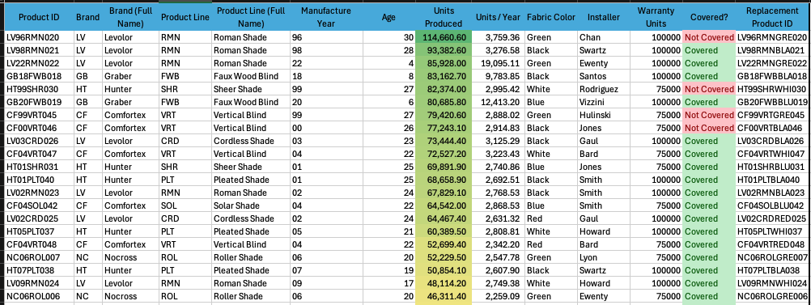
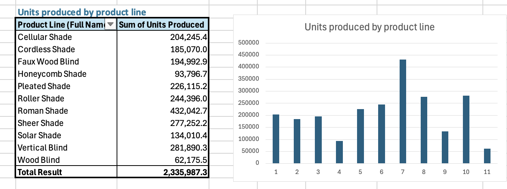
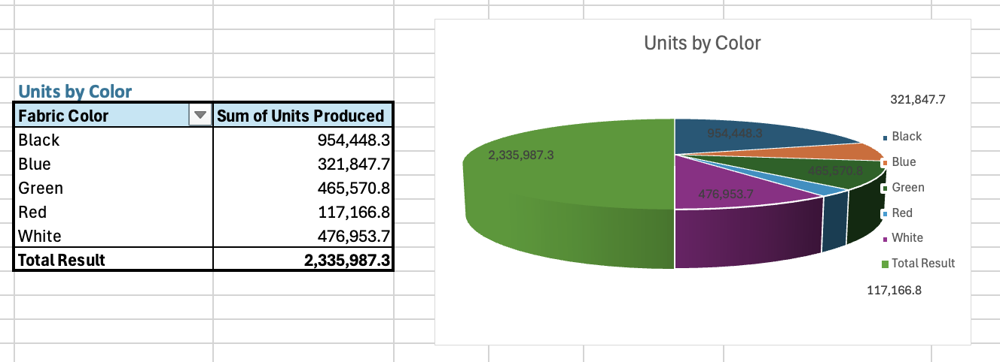
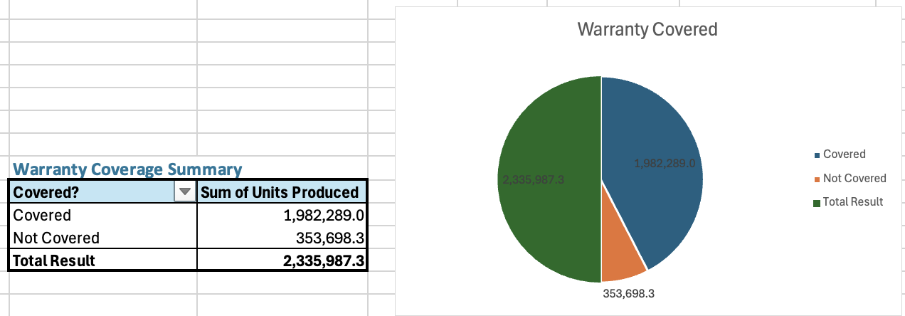

# Norman Inventory Dashboard

An Excel-based inventory tracking system for window treatment products, built to parse, validate, and report on product data using formulas only — no hardcoded values.

## Overview

This workbook simulates a product inventory dataset for a window-covering manufacturer, tracking units produced, warranty coverage, and product lifecycle data across multiple brands and product lines.

Cleaned a messy product inventory dataset containing inconsistent IDs, missing fields, and a brand name typo, using VLOOKUP to populate brand and product line names from lookup tables.

Built a dashboard using pivot tables to summarize units produced by product line, fabric color, and to break down warranty coverage status.

Visualized the results with bar and pie charts, all fully formula-driven so the dashboard updates automatically as the source data changes.

## Data Table

Each Product ID is parsed into Brand, Product Line, Manufacture Year, Age, and a generated Replacement Product ID using `LEFT`, `MID`, `RIGHT`, and `CONCATENATE`, with `VLOOKUP` pulling full names from reference tables.

## Dashboard

### Units Produced by Product Line

### Units Produced by Color

### Warranty Coverage Summary

## Skills demonstrated

- Excel formulas: `VLOOKUP`, `LEFT`, `MID`, `RIGHT`, `IF`, `CONCATENATE`, `UPPER`
- Data cleaning and validation
- Lookup table design
- PivotTables and chart-driven dashboard layout
- Conditional formatting for visual status flags

## File

[`Norman_Inventory_Dashboard.xlsx`](./Norman_Inventory_Dashboard.xlsx)
